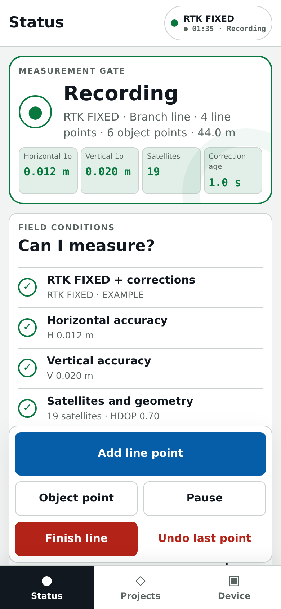
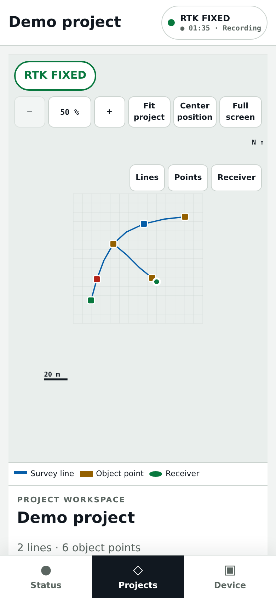
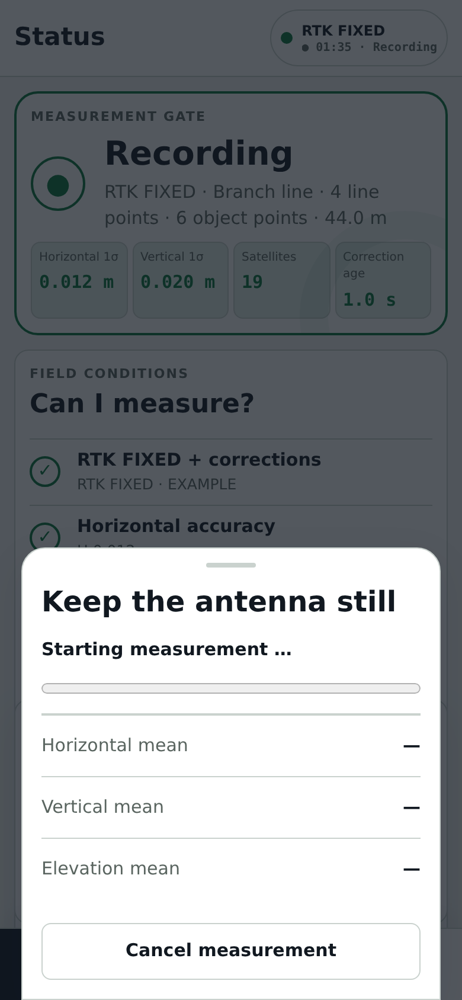
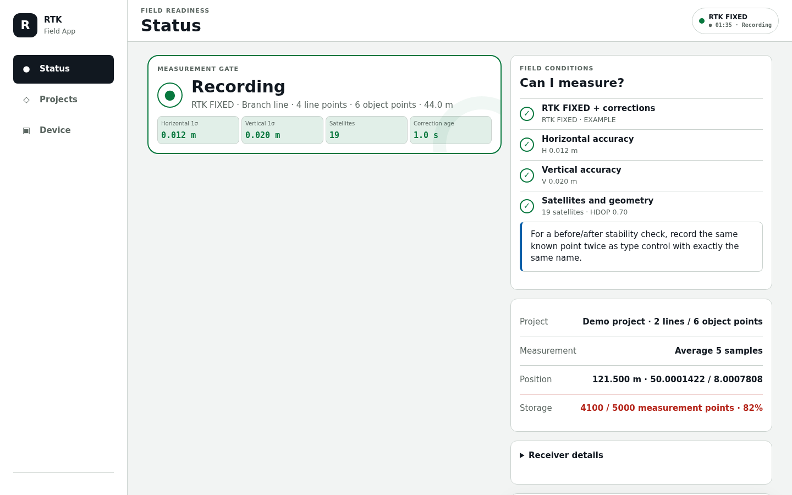

# ESP-RTK

ESP-RTK is MicroPython firmware for a compact RTK GNSS field device built from
an ESP32-S3 and a Quectel LC29H receiver. It pulls NTRIP correction data over
Wi-Fi, shows the measurement quality in a local web portal, and sends NMEA over
Bluetooth LE or TCP. Projects, lines, and asset points are stored on the device
itself and can be exported as GeoJSON, CSV, or a backup file.

Current firmware: **V15.8.0**

A short German quick guide for device users is in
[README.de.md](README.de.md). All technical documentation is English.

## Features

- NTRIP client over Wi-Fi with a primary caster and an optional independent
  fallback caster; each caster keeps its own host, port, mountpoint, and
  credentials. NTRIP can be switched off without deleting stored credentials.
- Periodic GGA upload to the caster (every 10 s by default) so VRS and
  network mountpoints receive a rover position.
- Local web portal over plain HTTP on port 80, reachable by mDNS as
  `http://<hostname>.local/`. A session is opened with the device code printed
  on the device label; state-changing requests additionally require a CSRF
  token.
- Bilingual user interface. German is selected automatically for a German
  browser, English otherwise, and the choice can be overridden in the portal.
- NMEA output over Bluetooth LE (Nordic UART Service) and over TCP on port
  10110, with a compatibility listener on port 2947.
- Measurement acceptance gate with configurable thresholds: required fix type,
  satellite count, HDOP, correction age, horizontal spread, and GST standard
  deviations. Every threshold can be reset to the factory values.
- Two recording modes per line: `survey` applies the full acceptance gate and
  averaging, `route` records continuously and also keeps rejected fixes,
  together with their rejection reasons.
- Projects, lines, and asset points are stored on the device and exported as
  GeoJSON, CSV, a full backup, or a single archive; backups can be imported
  again.
- Setup access point with a captive portal and a device label page that renders
  a Wi-Fi QR code, so a phone can join without typing the password.
- Watchdog, supervised asynchronous tasks with heartbeats, a persistent error
  log, and an on-device field diagnostics recorder.
- Configuration backup and restore, TCP authentication switch, and stream-token
  rotation from the authenticated portal.

## Hardware

The tested device combines an ESP32-S3 board with a Quectel LC29H(DA) carrier
board.

| Property | Value |
|---|---|
| SoC | Espressif ESP32-S3, 240 MHz |
| Radio | 2.4 GHz Wi-Fi, Bluetooth LE 5 |
| Flash | 16 MiB |
| PSRAM heap | about 7.8 MiB before the application starts |
| GNSS receiver | Quectel LC29H(DA), reporting `LC29HDANR11A04S_RSA` |
| MicroPython | v1.28.0, `ESP32_GENERIC_S3` (tested with the SPIRAM_OCT build) |

The ESP32-S3 has **no Bluetooth Classic**, so SPP cannot be added by
configuration or by a different MicroPython build. BLE, TCP, and physical USB
access are the available transports.

### Wiring

| ESP32-S3 | LC29H(DA) carrier | Signal |
|---|---|---|
| 5Vin | 5V | supply |
| GND | GND | ground |
| GPIO 17 (UART RX) | RX | NMEA from the receiver |
| GPIO 18 (UART TX) | TX | RTCM and `$PQTM` commands to the receiver |

The carrier board is labelled from the far end: the pin marked `RX` is the
module output and therefore goes to the ESP32-S3 input on GPIO 17. The firmware
uses UART 1 at 115200 baud, the status LED on GPIO 2, and the BOOT button on
GPIO 0. Never change wires or jumpers while the device is powered.

In normal operation the USB port of the GNSS carrier supplies both boards. The
native ESP32-S3 USB port is used for development and upload.

## Install

1. Flash MicroPython to the board. Firmware binaries are not part of this
   repository; download a `ESP32_GENERIC_S3` build from
   <https://micropython.org/download/ESP32_GENERIC_S3/>. The tested version is
   **v1.28.0**.
2. Install the host-side dependencies:

   ```sh
   python3 -m pip install -r requirements.txt
   ```

3. Copy the firmware files to the board over the serial port:

   ```sh
   python3 push.py . /dev/ttyACM0 --skip-unchanged
   ```

`push.py` transfers only the files on its allowlist, verifies every written
file by SHA-256, and restarts the board at the end. `--skip-unchanged` skips
files whose checksum on the board already matches.

## Quick start

1. Switch the device on and wait for the start to finish.
2. Scan the Wi-Fi QR code on the device label. If the setup network is not
   visible, press RST and then hold the **BOOT button for three seconds**.
   The setup access point is named after the device, for example
   `RTK-A1B2C3-SETUP`, and the portal answers at `http://192.168.4.1/`.
3. Open the portal and log in with the device code from the label.
4. Under **Device** configure Wi-Fi and NTRIP and save.
5. After the device has joined your network, open
   `http://<hostname>.local/`, for example `http://rtk-a1b2c3.local/`. If
   `.local` is not resolved by your router or phone hotspot, use the current IP
   address instead.

The portal works locally and without any cloud service. It uses HTTP, not
HTTPS.

## Screenshots

All data shown below is synthetic (a fake device name, network, caster, and
project) and does not come from a real device or field survey.






## Measuring in the field

The portal is organised in three areas:

- **Status** answers whether a measurement is currently allowed, and why not.
- **Projects** holds projects, lines, asset points, the map, and the exports.
- **Device** holds connections, configuration, log, and diagnostics.

Before a precise measurement:

1. Set the antenna up stably, vertically, and with a clear view of the sky.
2. Wait for **RTK FIXED** and the released measurement gate.
3. Select or create a project and start a line.
4. Choose a single shot, an average over 5 or 10 samples, or **until quality
   is OK**.
5. Check the quality values of the recorded point and back the project up.

The factory acceptance gate requires an RTK FIXED fix, at least 10 satellites,
HDOP of at most 1.5, corrections no older than 5.0 s, a horizontal spread of at
most 0.05 m across the samples, and GST standard deviations of at most 0.05 m
horizontally and 0.10 m vertically. The open-ended "until quality is OK" mode
evaluates a rolling window of 5 samples.

All of these thresholds are editable in the authenticated portal within
validated ranges (for example 4 to 60 satellites, HDOP 0.1 to 20.0, correction
age 0.1 s to 120.0 s, window 3 to 30 samples) and can be reset to the factory
values. The required fix type can be set to `RTK_FIXED`, `RTK_FLOAT`, or
`DGPS`. An averaged measurement takes between 1 and 30 samples.

A recorded point stores its fix status, satellite count, HDOP, correction age,
altitude, the receiver accuracy reported by GST, and, for averaged
measurements, the observed spread. The receiver is asked to enable its GST
output automatically, with retries, because that setting does not survive a
power cycle.

## Connections

| Connection | Use | Protection |
|---|---|---|
| Bluetooth LE (Nordic UART Service) | NMEA to a phone or field software | LE Secure Connections, six-digit passkey, bonding |
| TCP 10110 | NMEA on the local network | `AUTH <stream token>` before the first byte, on by default |
| TCP 2947 | compatibility listener for older clients | same as port 10110 |
| Web portal (HTTP, port 80) | operation and administration | device-code session and CSRF token |
| USB | firmware upload, diagnostics, maintenance | physical access |

TCP authentication can be switched off in the portal. Every new connection then
starts with NMEA data immediately, which is only advisable in a trusted,
isolated network. The stream token can be rotated from the portal.

NTRIP uses the configured primary caster first. If a connection attempt fails
and a fallback caster is configured, it is tried once before the exponential
backoff between 5 s and 300 s applies. After a healthy correction stream, the
next reconnect starts at the primary caster again. A caster that answers
`401` or `404` is retried only at the slowest interval, because that does not
heal by itself. Example host values look like `caster.example.net`.

The interface contract for integrators is in
[docs/integration.md](docs/integration.md).

## Help and recovery

- **Portal not reachable:** check which Wi-Fi the phone is on, replace `.local`
  with the current IP address, or force the setup network.
- **Setup mode:** press RST and hold **BOOT for three seconds**. Holding BOOT
  while power is applied starts the ROM bootloader instead, and the firmware
  does not run at all.
- **No measurement release:** work through the hints on the status screen from
  top to bottom, in particular the correction stream, RTK FIXED, a still
  antenna, and GST.
- **Bluetooth does not connect:** delete the existing pairing on the phone and
  pair again with the BLE passkey.
- **Factory reset:** hold **BOOT for ten seconds**. Wi-Fi and NTRIP
  credentials, the legacy tokens, and the BLE bonds are deleted, and the TCP
  stream token is rotated. **The point store and archived projects are not
  removed by a factory reset** — delete projects in the portal before handing
  a device on (see [Known limitations](docs/known-limitations.md)). The
  device identity, and therefore the device name, hostname, and device code,
  is retained.

Backups contain Wi-Fi and NTRIP credentials in clear text. They do not belong
in public storage or in support tickets.

## Documentation

For users and operators:

- [Set the device up and accept it](docs/onboarding.md)
- [Field diagnostics](docs/field-diagnostics.md)
- [German quick guide](README.de.md)

For developers and integrators:

- [Technical reference](docs/technical.md)
- [Boot sequence](docs/boot-sequence.md)
- [Interface contract](docs/integration.md)
- [Transport and security model](docs/transport-security.md)
- [Performance and limits](docs/performance-and-limits.md)
- [Known limitations](docs/known-limitations.md)
- [Changelog](CHANGELOG.md)
- [Contributing](CONTRIBUTING.md)
- [Security policy](SECURITY.md)
- [Third-party code](THIRD_PARTY.md)

## Development

Requirements are Python 3, a matching ESP32-S3 MicroPython build, and serial
access to the device. The test suite runs on the host, without hardware:

```sh
python3 -m unittest discover -s tests
```

`push.py` transfers only the files on its allowlist, which defines the
permitted board contents. After changes to JavaScript or CSS, `ASSET_VERSION`
in `assets.py` has to be raised, because the device caches those files
long-term and immutably.

Contribution rules, the commit conventions, and the review checklist are in
[CONTRIBUTING.md](CONTRIBUTING.md).

## License

This project is licensed under the **GNU Affero General Public License,
version 3 only** (`AGPL-3.0-only`). The full license text is in
[LICENSE](LICENSE). Code that is included under a separate license is listed in
[THIRD_PARTY.md](THIRD_PARTY.md).
