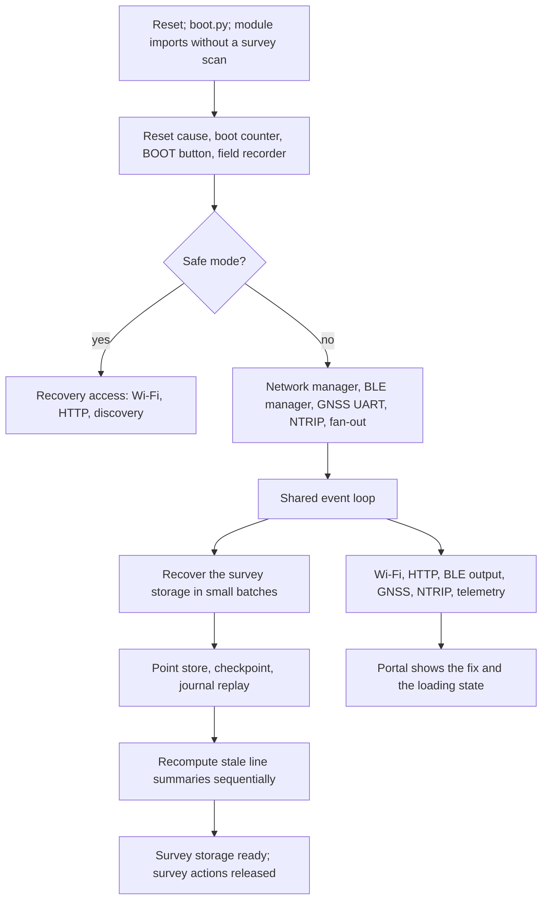

# Boot sequence

This document describes the order in which the firmware starts, and what is
already usable while the survey storage is still being recovered. The
module-by-module description is in [technical.md](technical.md); this one only
follows `boot.py` and `main.py` from reset to a running event loop.

The central property of the current start-up path is that access, GNSS, and
correction services are created **before** the survey storage is recovered.
Importing the application modules creates an unloaded tracker and an unloaded
point store, so no survey file is opened before the safe-mode decision.

## 1. `boot.py`

`boot.py` contains comments only. There is no wait and no Wi-Fi attempt in it.
MicroPython then executes `main.py`.

## 2. Module imports

`main.py` imports the application modules. At the end of `tracking.py` the
shared instance is created as `Tracker(autoload=False,
point_store_autoload=False)`, so the import creates neither loaded projects nor
a scanned point store.

## 3. Boot decision

`main()` reads the reset cause, raises the failed-boot counter, and decides
whether this is a safe-mode start. Safe mode is entered after
`SAFE_MODE_BOOTS` (5) consecutive boots that did not reach
`SAFE_MODE_UPTIME_SEC` (300 s) of uptime, and only crash-like reset causes are
counted; plugging the device in or a planned reset clears the counter.
`SAFE_MODE_UPTIME_SEC` is not a start-up delay: it defines when a running boot
counts as successful.

The start summary (reset cause, failed boots, version) is printed and also
written to the persistent error log, because the serial line is often not
re-enumerated yet at this point.

## 4. BOOT button

`check_access_button()` reads GPIO 0 once. If the button is not pressed it
returns immediately, so a normal boot costs nothing here. If it is pressed,
the level is sampled every 100 ms for `FACTORY_RESET_WINDOW_MS` (12 s):
ten seconds of hold trigger a factory reset followed by a restart, three
seconds force setup mode. Releasing before three seconds does nothing.

## 5. Crash evidence

If the failed-boot counter is above zero and the RTC flight recorder from the
previous run still holds content, that content is copied into the persistent
error log before anything else can overwrite it.

## 6. Field diagnostics

`field_recorder.initialize()` runs next, before the first network attempt. A
recorder that was enabled before the power cycle resumes with the same session
ID and a new random boot ID, writes a `boot` event, and flushes it to flash
immediately, so the boot is on disk before the possibly lengthy survey
recovery.

## 7. Safe mode, or the full service set

In safe mode only a network manager is created, and the started tasks are
`field_diagnostics`, `watchdog`, `gc`, `network`, `http`, and `discovery`.
NTRIP, BLE, and GNSS stay disabled, so the portal remains reachable for
repair. See [technical.md](technical.md), *Safe mode*.

Otherwise `main()` builds the full service set, in this order:

1. the bounded NMEA queue (`nmea_queue_size`, 512 entries),
2. `NetworkManager()`,
3. `BLEManager()`, which loads the stored bonds, activates BLE, registers the
   encrypted Nordic UART Service, and starts advertising - no Wi-Fi connection
   is required for that,
4. `GNSSHandler()`, and the BLE RX command sink that forwards validated
   receiver commands,
5. `NtripClient()`, the NMEA fan-out sender, and the telemetry task.

Wi-Fi is created before BLE on purpose: both radios draw on the same ESP-IDF
heap, and the Wi-Fi driver copes worse with a shortage than BLE does.

Only then are the supervised tasks created and handed to the event loop:
`field_diagnostics`, the shutdown handler, `watchdog`, `gc`, `led`, `network`,
`ntrip`, `http`, `discovery`, `gnss`, `ble`, `ble_output`, `tcp_output`,
`ble_events`, `nmea_tcp`, `telemetry`, and `tracking`.

## 8. Cooperative survey recovery

`tracking_startup_task` runs as one of those tasks. It publishes
`tracking_startup = {"state": "loading"}` and then calls
`tracker.initialize_async()`, which

1. loads the point store,
2. consumes the recovery generator, yielding to the event loop and feeding the
   task heartbeat every 16 steps: recover the index, load the checkpoint,
   replay the journal segments that are newer than the checkpoint, repair
   active references, recompute every line summary whose vertex count no
   longer matches the line, and rewrite the small index,
3. loads the archive index.

A summary that has to be recomputed is read through a sequential line
iterator over the point store, one step per vertex, instead of a random read
per position.

On success the state becomes `{"state": "ready", "duration_ms": ...}` and the
log records `Survey storage ready: <n> points in <ms> ms.` On failure the
tracker stays unloaded, the state becomes `{"state": "error"}`, the log
records `Survey recovery failed: ...`, and the task keeps its heartbeat alive
so the watchdog does not restart the device.

After a restart the first map request delivers a complete map; incremental
updates resume after that.

### What is usable while the survey loads

- Web access, BLE, and GNSS processing can already run. For portal access over
  the station interface, the Wi-Fi link must additionally have received its IP
  address.
- The portal shows *Loading survey storage*, or *Survey storage unavailable*
  after a failure, and keeps showing the current fix.
- `/api/tracking`, `/api/tracking/map`, `/api/tracking/line`, and
  `/api/tracking/export` answer `503` with the error code `survey_loading`
  rather than reading or changing a partially recovered survey.
  `/api/tracking/import` answers `409 storage_busy`, and arming the parallel
  benchmark answers `503 survey_loading`.
- Automatic survey points are refused until recovery has finished; the
  existing acceptance gate and the GNSS start-up guard continue to apply
  afterwards.
- `GET /api/ui/live` always carries `tracking_startup` at the top level, with
  the states `loading`, `ready` (with `duration_ms`), and `error`.
  `GET /status` carries the same object inside `tracking` while the survey is
  not loaded; once it is ready, the field is gone and the full survey status
  takes its place.

## Related documents

- [technical.md](technical.md) - modules, tasks, safe mode, storage layout
- [field-diagnostics.md](field-diagnostics.md) - the recorder started in step 6
- [performance-and-limits.md](performance-and-limits.md) - measured limits
